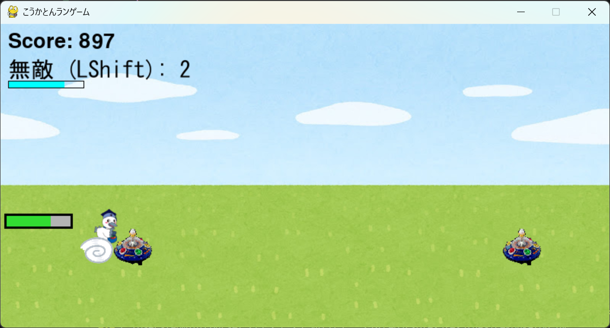

# 走れこうかとん

## 実行環境の必要条件
* python >= 3.10
* pygame >= 2.1

## ゲームの概要
* 自動で走るこうかとんをジャンプさせて障害物を避ける
* 参考URL：[恐竜ゲーム](chrome://dino/)

## ゲームの遊び方
* 障害物を避け続けてハイスコアを目指す
* ゲームは進むにつれスピードアップする
* スペースキー押下でジャンプし、障害物を避ける
* 左シフトキー押下で3回まで無敵時間を獲得できる
* キャラクター横のゲージが溜まると2段ジャンプを獲得する

## ゲームの実装
### 共通基本機能
* 背景画像，主人公キャラクター，障害物の描画
* 主人公キャラクターのジャンプ
* スコア（時間経過）
* リスタート

### 分担追加機能
* 時間経過で加速（担当：杉村）
* 2段ジャンプ：（担当：堺野）地面にいる間のみゲージが溜まる,ゲージが溜まったら使用可能，連続使用不可
* 障害物越えたらスコア加算（担当：岩井）
* 無敵状態（担当：シェク）：左シフトで無敵発動,無敵中発光,無敵中敵スルー,無敵制限時間あり,無敵3回まで使用可能
* スタート,ゲームオーバー画面（担当：椿）：スタートタイトルの画面揺れ,背景の透明黒背景,リスタート案内の表示,スタート案内表示

### ToDo
* 背景スクロール
* 障害物の種類追加
* 飛行